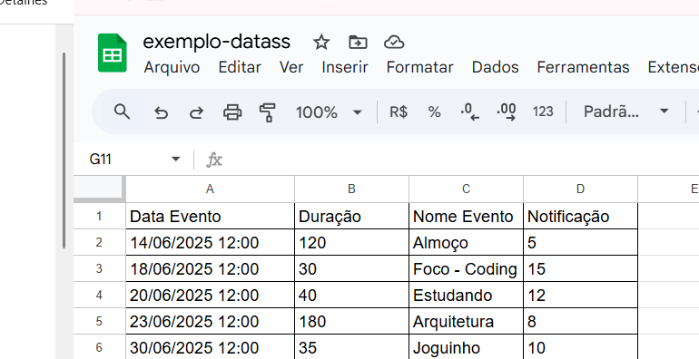
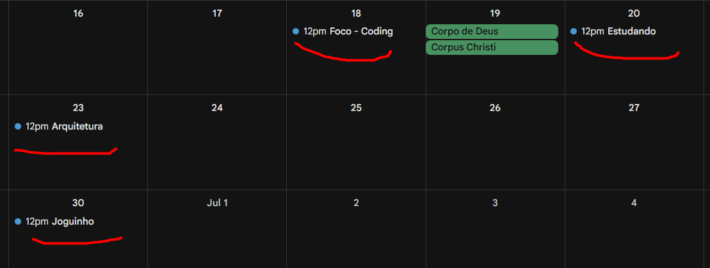

### Importação de Eventos na agenda.

O projeto é para **PROGRAMAR** uma solução que vai receber um xlsx e vai importar os eventos desse xlsx no google calendar.

Os eventos tem dia e hora para acontecer, tem a duração, tem o nome do evento/agenda, e tem o intervalo de noficação do evento.

Duração sempre em minutos.
Notificação sempre vai ser em minutos também.

Exemplo de arquivo, o arquivo sempre terá um cabeçalho no formato abaixo e pode ter n linhas.

Arquivo de exemplo:

Arquivo de exemplo: exemplo-datass.xlsx

Importar no google calendar.

O resultado que se espera por exemplo para o arquivo acima:

### Evento criado com o nome informado, e o periodo configurado.

