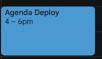
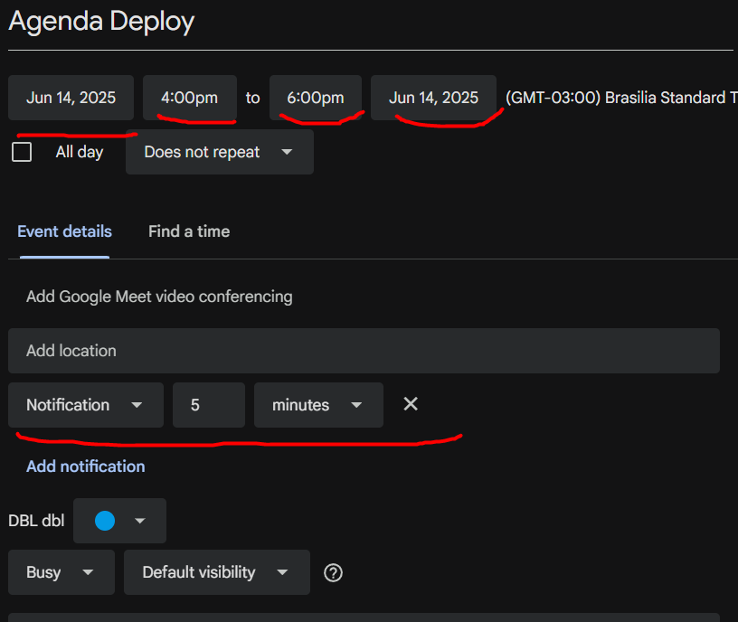

### Importação de Eventos na agenda.

O projeto é para **PROGRAMAR** uma solução que vai receber um csv e vai importar os eventos desse csv no google calendar.

Os eventos tem dia e hora para acontecer, tem a duração, tem o nome do evento/agenda, e tem o intervalo de noficação do evento.

Duração sempre em minutos.
Notificação sempre vai ser em minutos também.


Exemplo de arquivo, o arquivo sempre terá um cabeçalho no formato abaixo e pode ter n linhas.
```
horario;duracao;nomeevento;notificacao
14/07/2025 14:00:00;120;Agenda Deploy;5
```

Importar no google calendar.

O resultado que se espera por exemplo para o arquivo acima:

### Evento criado com o nome informado, e o periodo configurado.



### Evento criado, com o nome, duração, dia e notificação



